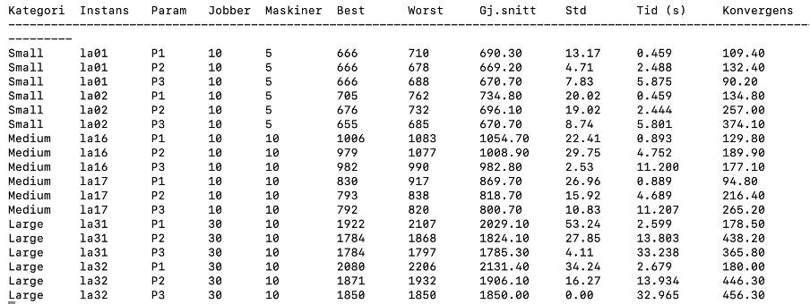
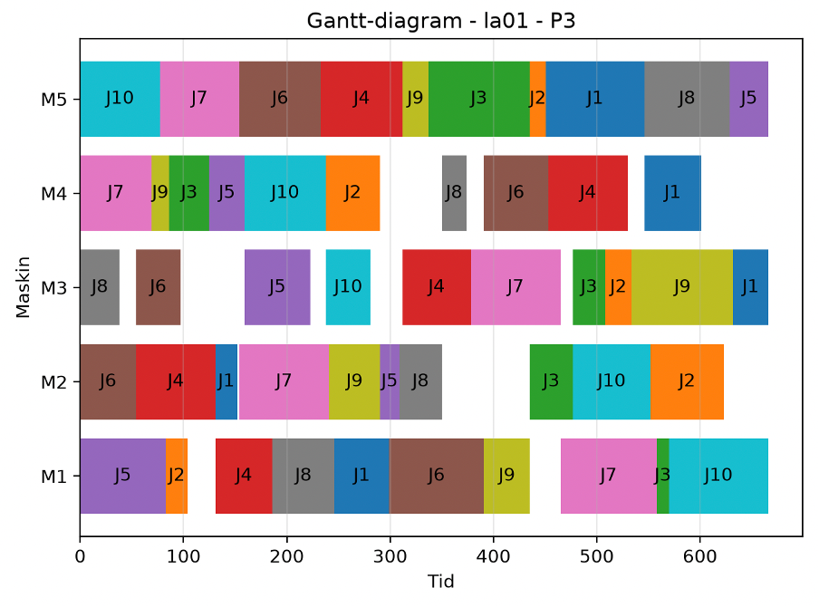

# JSSP-GA
Job Shop Scheduling Problem Using Genetic Algorithms

How to start the project?

cd JSSP-GA  
conda env create -f env.yml  
conda activate jssp-ga  
python main.py  

Results:

Gantt schedule:
